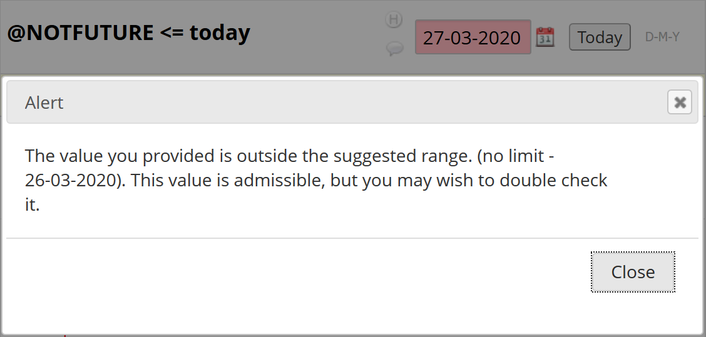

********************************************************************************
# Date Validation Action Tags: REDCap External Module

Luke Stevens, Murdoch Children's Research Institute https://www.mcri.edu.au

********************************************************************************
## Summary

Action tags to validate date and datetime field entries:
- `@PAST`       Entered value must be in the past, i.e. is earlier than today/now (today/now is out of range)
- `@FUTURE`     Entered value must be in the future, i.e. is later than today/now (today/now is out of range)
- `@NOTPAST`    Entered value must NOT be in the past, i.e. is today/now or later (today/now is in range)
- `@NOTFUTURE`  Entered value must NOT be in the future, i.e. is today/now or earlier (today/now is in range)

********************************************************************************
## Notes v1.1+

From v1.1.0 the implementation of the tags has been simplified to utilise the (from REDCap v12.1.0) functionality for using today/now as min or max for date and datetime fields:
- `@PAST`: max=today-1 (date fields)
- `@FUTURE`: min=today+1 (date fields)
- `@NOTPAST`: min=today
- `@NOTFUTURE`: max=today

- `@FUTURE` and `@NOTPAST` tags will be ignored if the field already has a **min** value specified.
- `@PAST` and `@NOTFUTURE` tags will be ignored if the field already has a **max** value specified.

Consequences of this change are:
- `@NOTPAST` and `@NOTFUTURE` are completely equivalent to using "today"/"now" as min/max value of range.
- `@NOTPAST` and `@NOTFUTURE` remain implemented only for backward compatibility.
- For datetime fields all tags are completely equivalent to using "now" as min/max value of range.

********************************************************************************
## Notes v1.0.0 v1.0.1 v1.0.2

- As with all action tags, these apply only to data entry form and survey form entry, not to data imports.
- If more than one of these tags is applied to a field only the first will be used.
- The action tag validation check is a soft check similar to existing range checks (i.e. a warning is displayed but the value is permitted). Use `@FORCE-MINMAX` to enforce a hard check (i.e. reject value).
- `@FUTURE`/`@NOTPAST`: when you enter a future date/time and then after that time return to the form, the validation check will be triggered only after data on the form has changed.

********************************************************************************
