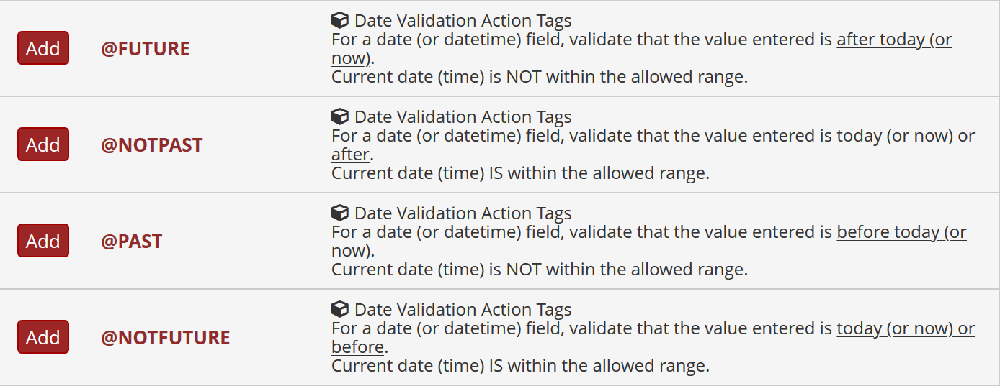

********************************************************************************
# Date Validation Action Tags: REDCap External Module

Luke Stevens, Murdoch Children's Research Institute https://www.mcri.edu.au

********************************************************************************
## Summary

Action tags to validate date and datetime field entries:
- @FUTURE     Entered value must be in the future, i.e. is later than today/now (today/now is out of range)
- @NOTPAST    Entered value must NOT be in the past, i.e. is today/now or later (today/now is in range)
- @PAST       Entered value must be in the past, i.e. is earlier than today/now (today/now is out of range)
- @NOTFUTURE  Entered value must NOT be in the future, i.e. is today/now or earlier (today/now is in range)

********************************************************************************
## Notes

- As with all action tags, these apply only to data entry form and survey form entry, not to data imports.
- If more than one of these tags is applied to a field only the first will be used.
- You may still specify min/max literal values. The action tag check is applied after the range check.
- The action tag validation check is a soft check similar to existing range checks (i.e. a warning is displayed but the value is permitted).
- @FUTURE/@NOTPAST: when you enter a future date/time and then after that time return to the form, the validation check will be triggered only after data on the form has changed.

********************************************************************************
